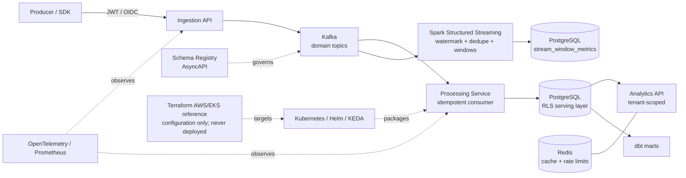

# Event-Driven Multi-Tenant Data Platform

**Kafka-to-serving platform engineering with event-time streaming, strict
tenant isolation, and locally executed failure/scaling evidence.**

[](https://github.com/darshil-mangukiya/event-driven-data-platform/actions/workflows/ci.yml)


[](LICENSE)

This multi-tenant data platform handles authenticated domain events.
FastAPI services publish events to Kafka, idempotent consumers write a
PostgreSQL serving layer, and dbt models expose governed analytics. PostgreSQL
row-level security enforces tenant boundaries below the application layer.

The repository also includes a Spark Structured Streaming path, Redis caching,
schema governance, observability, reliability exercises, Kubernetes and Helm
packaging, and a validate-only Terraform target for AWS/EKS.

## At a Glance

| Current source/runtime result | Scope |
| --- | --- |
| **7 / 50** | FastAPI applications / route decorators |
| **7 / 12 / 20** | Kafka topics / event types / JSON Schema files |
| **34 / 1 / 33 / 11** | PostgreSQL tables / views / indexes / FORCE RLS tables |
| **5** | Spark Structured Streaming queries executed from a persisted checkpoint |
| **17/17** | dbt nodes passed: 7 models and 10 tests |
| **6 / 5 / 11** | governed data products / consumers / requirements |
| **27 / 58** | catalog entries / project-native lineage nodes |
| **28 / 19 / 10 / 31** | source metric families / alert rules / project SLOs / Grafana panels |
| **23 / 21 / 1** | raw Kubernetes manifest objects / rendered Helm objects / KEDA ScaledObjects |
| **2 / 22** | Airflow DAGs / modeled tasks (12 operational, 10 batch) |
| **466 passed / 9 skipped** | current full pytest result (475 collected) |
| **8/8** | required workloads Ready on a disposable local `kind` cluster |
| **1 -> 5 -> 1** | processing replicas during a real 20K-event KEDA lag cycle |

## What Is Actually Executed

| Evidence class | Capabilities |
| --- | --- |
| **EXECUTED AND VERIFIED** | Docker Compose Kafka path, redelivery/idempotency, schema compatibility, PostgreSQL RLS, Redis fallback, five Spark queries and checkpoint restart, dbt, reconciliation, both Airflow DAGs, Prometheus/Grafana, one local cross-Kafka OpenTelemetry trace, local Kubernetes, Helm lifecycle, KEDA autoscaling, bounded load/failure exercises |
| **IMPLEMENTED AND TESTED** | Strict JWT/OIDC/JWKS behavior |
| **CONFIGURATION VALIDATED** | Terraform AWS/EKS reference architecture; NetworkPolicy/security hardening where the local cluster did not enforce it |
| **NEVER CLOUD DEPLOYED** | AWS, Azure, and GCP resources: zero |

The precise status and limitations for every run are in the
[runtime manifest](evidence/runtime/runtime_manifest.json).

## 5-Minute Review

1. Follow the [event architecture](docs/ARCHITECTURE.md).
2. Inspect [Kafka redelivery without duplicate effects](evidence/runtime/kafka/delivery_semantics.json).
3. Review the [Spark watermark matrix](evidence/runtime/streaming/watermark_matrix.csv) and [checkpoint result](evidence/runtime/streaming/RESULT.md).
4. Verify [PostgreSQL tenant isolation](evidence/runtime/postgres_rls/result.md).
5. Read the [local Kubernetes](evidence/runtime/kubernetes/result.md) and [Helm lifecycle](evidence/runtime/helm/result.md) results.
6. Inspect the [KEDA scaling timeline](evidence/runtime/keda/autoscaling_timeline.csv).
7. Compare the bounded [load profiles](evidence/runtime/performance/README.md).
8. Use the [reliability summary](evidence/runtime/reliability/result.md) and [observability validation](evidence/runtime/prometheus/PROMETHEUS_VALIDATION.md).

## Architecture



See [docs/ARCHITECTURE.md](docs/ARCHITECTURE.md) for component and data-flow
details.

## Event Lifecycle

1. A producer sends a signed JWT or OIDC token with a versioned event.
2. Ingestion validates authentication, authorization, and the event contract.
3. Kafka partitions the event by tenant and entity key.
4. The processing service consumes with at-least-once delivery.
5. An idempotency key collapses repeated delivery into one business effect.
6. Tenant-facing database work runs as `platform_tenant_scoped` with a
   transaction-local `app.tenant_id` value.
7. PostgreSQL RLS constrains reads and writes to that tenant.
8. dbt marts and the analytics API expose reconciled metrics.

## Key Properties

### Tenant isolation

Tenant identity is set with `set_config('app.tenant_id', ..., true)` inside the
database transaction. The value expires before the pooled connection is
released. Tenant-facing services use a `NOSUPERUSER`, `NOBYPASSRLS` role, and
all protected tables use `FORCE ROW LEVEL SECURITY`.

| Role | Use | Superuser | BYPASSRLS |
| --- | --- | :---: | :---: |
| `platform` | Database initialization and administration | Yes | Yes |
| `platform_tenant_scoped` | Analytics, processing, and dashboard traffic | No | No |
| `platform_admin_bypass` | Local cross-tenant metadata and operations tools | No | Yes |

`AUTH_MODE=strict` is the code default. The local Compose configuration uses
`AUTH_MODE=dev_compat` so the documented header-based demo commands work.
Services running in `dev_compat` trust caller-supplied identity headers and must
remain restricted to a local development environment. OIDC/JWKS verification
uses RS256, issuer validation, optional audience validation, and a required
non-empty string tenant claim.

The ops console and demo dashboard are local interfaces without authentication.
The ops console has cross-tenant visibility through `platform_admin_bypass`;
the dashboard queries protected tables through `platform_tenant_scoped`.

See [docs/security.md](docs/security.md) and
[docs/SECURITY_AND_TENANCY.md](docs/SECURITY_AND_TENANCY.md).

### Delivery and reconciliation

Processing uses at-least-once delivery with idempotent writes. A verification
run published one logical event at 100 Kafka offsets and produced one row in
both `raw_events` and `processed_orders`.

The reconciliation job independently recomputes:

- revenue from `processed_orders`;
- payment counts and failures from `processed_payments`;
- active users, new users, and churn signals from `processed_user_sessions`.

Those results are compared with `tenant_metrics_daily`. See
[docs/reconciliation.md](docs/reconciliation.md).

### Contracts and governance

The schema registry enforces subject, version, and
BACKWARD/FORWARD/FULL compatibility rules. AsyncAPI 3.0 and six OpenAPI
documents are generated from topic, schema, and route definitions. Data-product
contracts connect consumer requirements, source events, serving tables,
metrics, APIs, and ownership metadata.

### Streaming and analytics

The Spark queries apply contract validation, event-time watermarking,
`dropDuplicatesWithinWatermark`, late-event classification, windowed
aggregation, and idempotent `foreachBatch` upserts. A bounded local container
run launched all five queries, exercised on-time/out-of-order/late/duplicate
events, and resumed from its persisted checkpoint. The focused Structured
Streaming suite passed 43 tests.

PostgreSQL feeds three dbt staging models, three marts, a tenant dimension, and
four semantic metrics. The recorded local `dbt build` completed all 17 nodes.

### Reliability and observability

Reliability scenarios cover duplicate and poison events, late arrival, consumer
lag, database and Redis outages, reconciliation mismatch, and consumer interruption.
Redis cache failures fall back to PostgreSQL and recover after Redis returns.

Prometheus scrapes service metrics, Grafana provisions its datasource and
dashboard, and the local run verified seven scrape targets and all 33 dashboard
queries. A temporary local Jaeger backend captured one seven-span trace across
ingestion and processing, verifying W3C context continuity through Kafka. The
default Compose stack still omits a trace backend, and PostgreSQL client spans
are not instrumented. Alert and project-SLO thresholds are local defaults.

### Incident analysis

`ai_incident_copilot/` converts deterministic reliability evidence into a
schema-validated incident analysis. The default provider is offline and
rule-based. Each analysis cites evidence and requires human approval. The
package has no infrastructure mutation or command-execution path. An external
provider class is an unimplemented extension point and requires an environment
key before construction.

## Technology Stack

| Layer | Technologies |
| --- | --- |
| APIs | Python, FastAPI, Pydantic, Uvicorn, asyncpg |
| Streaming | Kafka, Spark Structured Streaming |
| Storage | PostgreSQL, Redis, MinIO |
| Analytics | dbt Core, semantic metrics |
| Contracts | Schema Registry, AsyncAPI, OpenAPI, data-product contracts |
| Security | JWT, OIDC/JWKS, PostgreSQL RLS, separated database roles |
| Observability | OpenTelemetry instrumentation, Prometheus, Grafana |
| Platform | Docker Compose, Kubernetes, Helm, KEDA |
| Infrastructure | Terraform AWS/EKS reference architecture (never deployed) |
| Quality | pytest, Ruff, GitHub Actions, pip-tools |

## Run Locally

```bash
git clone https://github.com/darshil-mangukiya/event-driven-data-platform.git
cd event-driven-data-platform
python -m venv .venv
source .venv/bin/activate
make setup
docker compose up --build
```

Fresh PostgreSQL volumes apply tenant RLS during initialization. Existing
volumes created with an earlier schema require the one-time step described in
[docs/security.md](docs/security.md).

```bash
make demo
```

| Component | URL |
| --- | --- |
| Ingestion API | <http://localhost:8001/docs> |
| Analytics API | <http://localhost:8003/docs> |
| Demo dashboard | <http://localhost:8005/?tenant_id=tenant_demo> |
| Ops console | <http://localhost:8006/?tenant_id=tenant_demo> |
| Grafana | <http://localhost:3000> (`admin` / `admin`) |

Host-published local services bind to loopback by default. Ops console, demo
dashboard, and schema registry authentication are not configured.

The local `dev_compat` request path accepts identity headers:

```bash
curl 'http://localhost:8003/metrics/revenue?tenant_id=tenant_demo' \
  -H 'X-Tenant-Id: tenant_demo'
```

Signed-token examples are documented in [docs/security.md](docs/security.md).

## Verification

```bash
PYTHONPATH=.:services/shared python -m pytest -q
ruff check --no-cache .
make ci-local
```

The validation suite covers contracts, tenant RLS, authentication posture,
catalog and lineage references, data-product and metric contracts, privacy
metadata, AsyncAPI generation, Docker Compose configuration, Helm rendering,
and evidence links. Current capability records and command output are indexed
in [evidence/README.md](evidence/README.md).

## Deployment Status

| Environment | Status |
| --- | --- |
| Docker Compose | Verified locally |
| Kubernetes (`kind`) | 8/8 required workloads verified in a disposable local cluster |
| Helm | Lint, render, local install, upgrade, rollback, and topic-bootstrap hook verified |
| KEDA | KEDA 2.20.2 and Kafka-lag scaling verified locally: replicas 1 -> 5 -> 1 |
| Terraform / AWS | `init -backend=false`, `fmt`, and `validate` passed; never planned or applied |
| GitHub Actions | Workflow configured; current state is shown by the CI badge |

## Project Structure

```text
services/              FastAPI services and shared runtime helpers
sdk/python/            Python producer SDK
platform_cli/          Local operator CLI
database/              PostgreSQL schema, migrations, initialization, and RLS
dbt/                   Staging, mart, and semantic models
spark/                 Batch jobs and Structured Streaming pipeline
contracts/             Event, API, and data-product contracts
catalog/               Data catalog
lineage/               Lineage graph and runtime event helpers
deploy/                Kubernetes manifests and Helm chart
infra/                 Validate-only AWS/EKS Terraform target
monitoring/            Prometheus, Grafana, alert, and SLO configuration
reliability/           Failure scenarios and structured evidence generation
ai_incident_copilot/   Human-approved incident analysis
tests/                 Unit, contract, security, integration, and streaming tests
evidence/              Curated capability verification records
docs/                  Architecture and operational documentation
```

## Current Boundaries

- Deployment verification is local to Docker Compose and `kind`.
- AWS Terraform has been validated and has not been applied.
- KEDA scale-up and scale-down were observed only in a bounded local lag test.
- Five Spark streaming queries and checkpoint restart were executed locally;
  no production streaming scale is claimed.
- One local OpenTelemetry trace verified Kafka propagation across two services;
  the backend is not in default Compose and PostgreSQL spans are not instrumented.
- Both Airflow DAGs were executed locally; this is not production scheduling evidence.
- Performance measurements are single-host local results.
- The ops console and demo dashboard require an authentication layer before
  network exposure.
- Delivery semantics are at-least-once with idempotent processing.
- The external incident-analysis provider is not implemented.

See [docs/LIMITATIONS.md](docs/LIMITATIONS.md) for details.

## Documentation

- [Architecture](docs/ARCHITECTURE.md)
- [Security](docs/security.md)
- [Streaming](docs/streaming_architecture.md)
- [Observability](docs/OBSERVABILITY.md)
- [Testing](docs/testing-strategy.md)
- [Reliability](docs/reliability.md)
- [Reconciliation](docs/reconciliation.md)
- [Evidence](evidence/README.md)
- [AsyncAPI](contracts/asyncapi.yml)

## License

[MIT](LICENSE)
