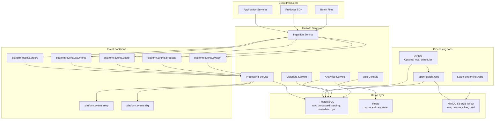

# Architecture

The project is organized as a shared data platform for tenant-aware event ingestion, processing, and analytics delivery. The local implementation focuses on clear service ownership, contract validation, reliable processing patterns, and observable operations.

## System Diagram

## Local Architecture

- FastAPI services expose ingestion, metadata, analytics, processing health, dashboard, and operations surfaces.
- Kafka separates event domains and retry/DLQ flows.
- PostgreSQL stores raw events, processed facts, serving aggregates, tenant metadata, audit logs, operational health, and quality results.
- Redis caches hot tenant metrics and keeps lightweight rate-limit state.
- PySpark jobs support bounded backfills, normalization, sessionization, and object-storage-oriented processing.
- Optional Airflow DAGs schedule finite validation, reconciliation, backfill dry-run, and Spark batch workflows.
- Prometheus runs in the local stack, and Grafana dashboard JSON is included as an importable observability asset.

## Implemented Vs Extension Matrix

| Capability | Local Status | Evidence | Production Extension Path |
| --- | --- | --- | --- |
| FastAPI microservices | Implemented locally | `services/`, OpenAPI specs, pytest coverage | Horizontal scaling and stricter deployment policies. |
| Kafka ingestion | Runnable locally | `kafka/topics.yaml`, ingestion service, contract tests | Multi-broker Kafka or managed Kafka. |
| PostgreSQL serving | Implemented locally | schema, migrations, analytics repositories | Managed Postgres, PITR, read replicas, partitioning. |
| Redis cache | Implemented locally | analytics cache usage, Redis config | Managed Redis with alerting and failover. |
| Spark jobs | Runnable locally | `spark/jobs/` | Scheduler, larger cluster, object storage partitions. |
| Airflow orchestration | Optional local layer | `airflow/`, `docker-compose.airflow.yml` | Remote logs, executor sizing, secrets, alerting, and deployment hardening. |
| Event contracts | Implemented locally | `contracts/`, validation and compatibility scripts | Managed/hosted schema registry if the team outgrows the in-repo one. |
| Schema Registry (subject/version/compatibility) | Implemented, live-verified | `services/schema-registry-service/`, `evidence/validation/schema-registry-verification.md`, [ADR 0007](adr/0007-in-repo-schema-registry-and-asyncapi.md) | Horizontal scaling if registry load grows. |
| AsyncAPI spec | Generated, live-verified | `contracts/asyncapi.yml`, `scripts/generate_asyncapi.py` | Publish to a docs portal. |
| Tenant-aware APIs | Implemented locally | auth helper, tenant tests, API filters | Broader OIDC scope/claim policy as IdP integration deepens. |
| OIDC/JWKS auth | Implemented, live-verified against a real Keycloak | `services/shared/platform_shared/oidc.py`, `evidence/validation/oidc-verification.md`, [ADR 0009](adr/0009-dual-mode-auth-oidc-with-local-hs256-fallback.md) | Point at the org's real IdP; local HS256 fallback stays for dev/CI. |
| RLS SQL | Implemented, live-verified (`FORCE ROW LEVEL SECURITY`, non-superuser tenant-scoped role) — and now the actual runtime connection role for the tenant-facing analytics API and the Kafka processing consumer, with transaction-local tenant context set per request/write | `database/security/`, `evidence/validation/rls-runtime-verification.md`, `evidence/validation/application-rls-runtime-verification.md` | Point production traffic at a managed Postgres with the same role split; no local-side extension remains outstanding. |
| Distributed tracing | Implemented, opt-in, live-verified against Jaeger | `services/shared/platform_shared/tracing.py`, `evidence/validation/opentelemetry-verification.md`, [ADR 0010](adr/0010-opt-in-opentelemetry-tracing.md) | Point `OTEL_EXPORTER_OTLP_ENDPOINT` at a managed collector. |
| Observability | Configured locally | Prometheus, Grafana JSON, alert rules, logs, Kafka consumer-lag gauge | Central metrics, logs, traces, alert routing. |
| Kubernetes | Implemented, real `kubectl`/Helm execution against a local `kind` cluster | `deploy/kubernetes/`, `deploy/helm/cloudscale/`, `evidence/validation/kubernetes-verification.md`, [ADR 0008](adr/0008-kind-for-local-kubernetes-eks-as-target.md) | Apply to a real EKS cluster (Terraform target already validated). |
| Autoscaling (KEDA) | Configuration-only; lag readable, scale cycle not observed | `deploy/kubernetes/base/40-keda-scaledobject.yaml`, `evidence/validation/keda-autoscaling-live-verification.md` | Exercise with a partitioned topic and sustained backlog. |
| AWS target (Terraform) | Validated, not applied | `infra/aws/terraform/eks.tf`, `evidence/validation/terraform-verification.md` | `terraform apply` with explicit authorization and budget. |
| AI Streaming Incident Copilot | Implemented offline, tested, human-approval-gated | `ai_incident_copilot/`, `tests/test_ai_incident_copilot.py` | Implement and assess an external provider before enabling one. |
| Load testing | Runnable locally | k6 scripts and Python load scripts | Distributed load generators and production-like volumes. |
| DLQ replay | Dry-run and audit model | CLI and DLQ tool | Approved republish workflow and operator controls. |
| Backfill | Dry-run and SQL support | CLI, scripts, `sql/backfill/` | Orchestrated backfills with approval and monitoring. |
| Lakehouse storage | Optional local pattern | Spark jobs and `lakehouse/README.md` | S3 plus Delta/Iceberg/Hudi only if implemented later. |
| Kafka Connect (archival) | Not executed | — | Deferred; see `docs/LIMITATIONS.md`. |

## Design Tradeoffs

- Shared-schema tenancy keeps the local platform approachable, but high-risk tenants may need RLS, schema isolation, or dedicated infrastructure.
- PostgreSQL is strong for low-latency internal serving tables, while object storage is better for long-term replay, archive, and historical processing.
- Kafka domain topics reduce coupling but require more topic ownership and compatibility discipline.
- Redis improves repeated dashboard reads but requires careful TTL and invalidation behavior.
- Spark is useful for historical rebuilds, but a production system would add orchestration and stronger job observability.
- Airflow schedules finite operational and batch workflows. Long-running Kafka consumers remain service-owned because they are continuously running services, not bounded batch jobs.

## Extended Platform Capabilities

The local-first architecture also includes cloud-native packaging and
streaming-reliability components:

- A Schema Registry service and generated AsyncAPI spec sit in front
  of the event contracts already shown above.
- The same services are packaged as raw Kubernetes manifests and a Helm
  chart, executed against a local `kind` cluster, with KEDA wired to
  the same Kafka-consumer-lag signal Prometheus exposes.
- OIDC/JWKS and RLS harden the auth and database layers already in the
  diagram, without changing their shape.
- OpenTelemetry adds an opt-in trace across the Kafka boundary already
  shown (Ingestion Service → `platform.events.*` → Processing Service).
- An incident copilot (`ai_incident_copilot/`) consumes the
  same reliability-exercise and reconciliation evidence this platform
  already produces and has no infrastructure mutation path.

See the Implemented vs. Extension matrix above for the specific status of
each, and `docs/adr/0007`–`0010` for the reasoning.

## Reference Docs

- Detailed diagrams: `docs/architecture-diagrams.md`
- ADRs: `docs/adr/`
- Storage design: `docs/storage-design.md`
- Query optimization: `docs/query-optimization.md`
- Scaling notes: `docs/scaling-strategy.md`
- Lakehouse notes: `lakehouse/README.md`
- Kubernetes/Helm/KEDA: `deploy/kubernetes/`, `deploy/helm/cloudscale/`, `evidence/validation/kubernetes-verification.md`, `evidence/validation/helm-verification.md`, `evidence/validation/keda-autoscaling-live-verification.md`
- AWS target: `infra/aws/terraform/`, `evidence/validation/terraform-verification.md`
- Security depth: `docs/security.md`, `evidence/validation/oidc-verification.md`, `evidence/validation/rls-runtime-verification.md`
- Tracing: `evidence/validation/opentelemetry-verification.md`
- AI Incident Copilot: `ai_incident_copilot/AI_CONTROL_BOUNDARIES.md`, `tests/test_ai_incident_copilot.py`
- Local runtime records: `evidence/README.md`
