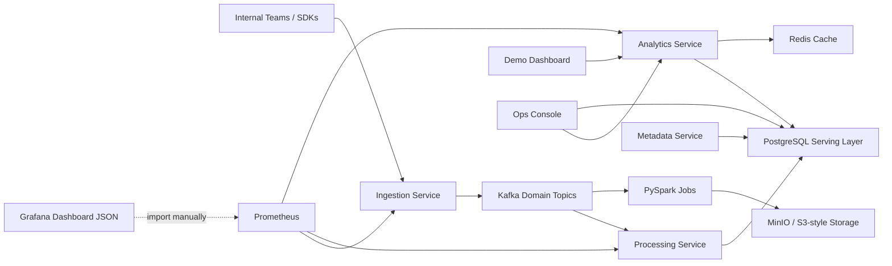
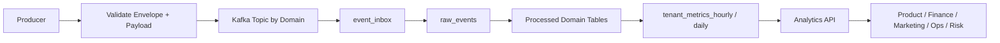
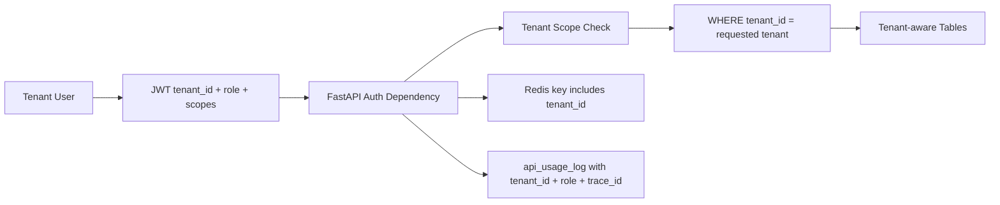
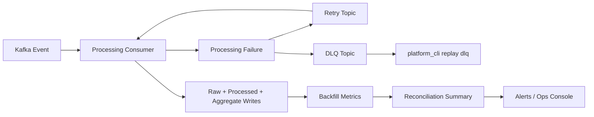
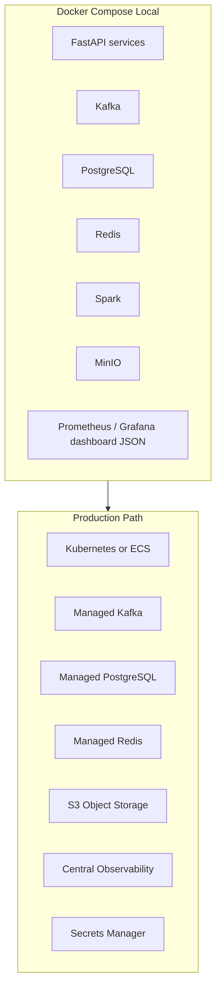

# Architecture Diagrams

## System Architecture

```mermaid
flowchart LR
    Clients["Internal Teams / SDKs"] --> Ingestion["Ingestion Service"]
    Ingestion --> Kafka["Kafka Domain Topics"]
    Kafka --> Processing["Processing Service"]
    Kafka --> Spark["PySpark Jobs"]
    Processing --> Postgres["PostgreSQL Serving Layer"]
    Spark --> Lakehouse["MinIO / S3-style Storage"]
    Metadata["Metadata Service"] --> Postgres
    Analytics["Analytics Service"] --> Postgres
    Analytics --> Redis["Redis Cache"]
    Dashboard["Demo Dashboard"] --> Analytics
    Ops["Ops Console"] --> Analytics
    Ops --> Postgres
    Prometheus["Prometheus"] --> Ingestion
    Prometheus --> Processing
    Prometheus --> Analytics
    Grafana["Grafana Dashboard JSON"] -. import manually .-> Prometheus
```

## Event Flow

```mermaid
flowchart LR
    Producer["Producer"] --> Validate["Validate Envelope + Payload"]
    Validate --> Topic["Kafka Topic by Domain"]
    Topic --> Inbox["event_inbox"]
    Inbox --> Raw["raw_events"]
    Raw --> Processed["Processed Domain Tables"]
    Processed --> Agg["tenant_metrics_hourly / daily"]
    Agg --> API["Analytics API"]
    API --> Consumer["Product / Finance / Marketing / Ops / Risk"]
```

## Tenant Isolation

```mermaid
flowchart LR
    User["Tenant User"] --> Token["JWT tenant_id + role + scopes"]
    Token --> API["FastAPI Auth Dependency"]
    API --> Check["Tenant Scope Check"]
    Check --> SQL["WHERE tenant_id = requested tenant"]
    SQL --> Postgres["Tenant-aware Tables"]
    API --> Cache["Redis key includes tenant_id"]
    API --> Audit["api_usage_log with tenant_id + role + trace_id"]
```

## Reliability Flow

```mermaid
flowchart LR
    Kafka["Kafka Event"] --> Consumer["Processing Consumer"]
    Consumer --> Success["Raw + Processed + Aggregate Writes"]
    Consumer --> Failure["Processing Failure"]
    Failure --> Retry["Retry Topic"]
    Retry --> Consumer
    Failure --> DLQ["DLQ Topic"]
    DLQ --> Replay["platform_cli replay dlq"]
    Success --> Backfill["Backfill Metrics"]
    Backfill --> Reconcile["Reconciliation Summary"]
    Reconcile --> Alerts["Alerts / Ops Console"]
```

## Deployment Shape

```mermaid
flowchart TB
    subgraph Local["Docker Compose Local"]
        L1["FastAPI services"]
        L2["Kafka"]
        L3["PostgreSQL"]
        L4["Redis"]
        L5["Spark"]
        L6["MinIO"]
        L7["Prometheus / Grafana dashboard JSON"]
    end
    subgraph Prod["Production Path"]
        P1["Kubernetes or ECS"]
        P2["Managed Kafka"]
        P3["Managed PostgreSQL"]
        P4["Managed Redis"]
        P5["S3 Object Storage"]
        P6["Central Observability"]
        P7["Secrets Manager"]
    end
    Local --> Prod
```
