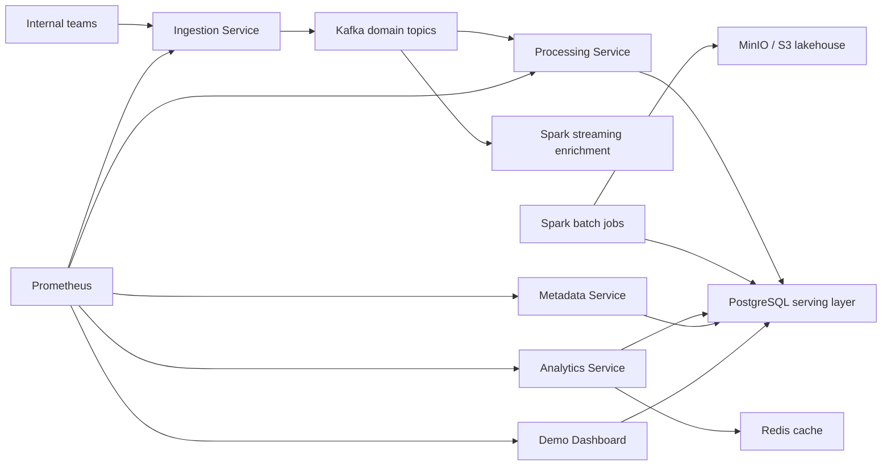
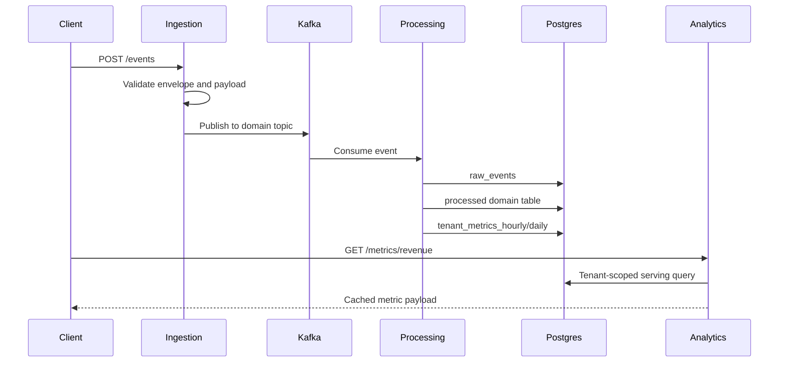
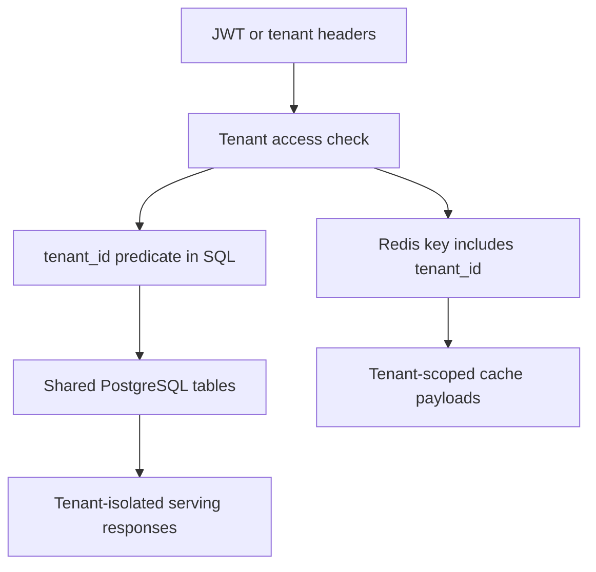
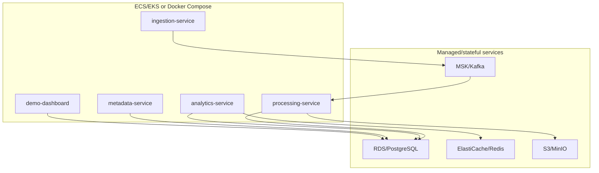

# Architecture Visuals

## System Architecture

## Event Flow

## Tenant Isolation

## Deployment Shape

## Data Lineage

See [Lineage and Data Catalog](lineage.md) for the table-level graph and ownership map.

