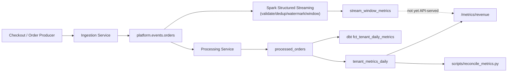
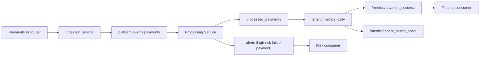
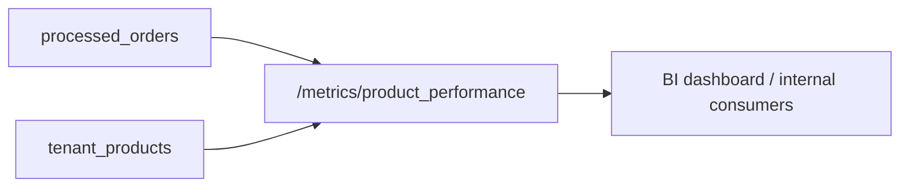
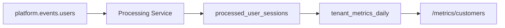
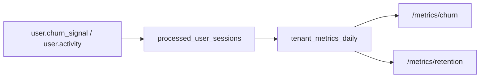
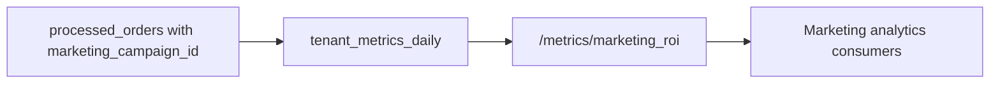
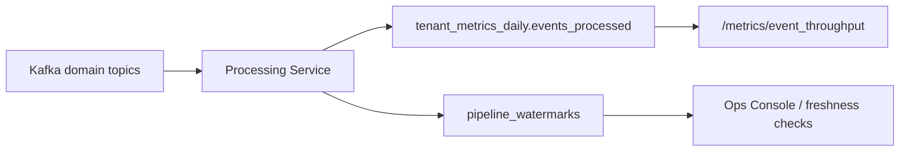

# KPI Lineage

For the data-product-contract view of this same lineage (consumer,
freshness, SLO, tenant isolation, acceptance criteria), see
[docs/data-products.md](data-products.md) and the machine-readable
`contracts/data_products/registry.yml`. For the full, cross-reference-validated
table-level lineage graph covering all tables in addition to KPIs, generated from
`catalog/data_catalog.json`, see [docs/lineage.md](lineage.md) and
[evidence/lineage/lineage-graph.md](../evidence/lineage/lineage-graph.md).

## Net Revenue

The Structured Streaming path  is a second, parallel lineage for
the same source events — it computes its own windowed revenue into
`stream_window_metrics` with event-time semantics the async path doesn't
have (watermarking, late-event handling, exactly-the-window-you-asked-for
aggregation). It is **not yet merged** into the value `/metrics/revenue`
serves; the dotted line above marks that gap explicitly rather than
implying the two paths are already unified. See
`docs/streaming_architecture.md` for why both paths exist side by side.

## Payment Success Rate

## Product Performance

## Tenant Health Score Inputs

Tenant health score is an operational composite. It should not be treated as a finance metric.

Inputs:

- payment failure rate
- event throughput
- processed event volume
- service health summaries
- cache hit/miss trend
- Kafka lag indicators

## Customer Growth

## Churn and Retention

## Marketing ROI

## Event Throughput

