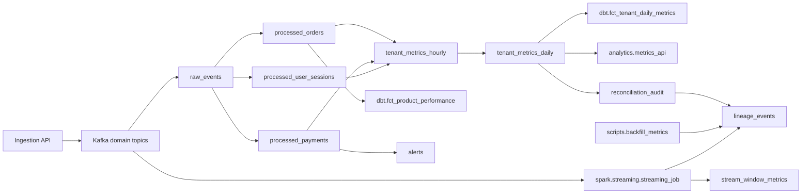

# Lineage and Data Catalog

`catalog/data_catalog.json` records ownership, layer, grain, keys,
dependencies, and metric definitions. `lineage/` validates the graph and
emits run-level lineage events.

## Commands

```bash
python scripts/validate_catalog.py
PYTHONPATH=. python scripts/validate_lineage.py
PYTHONPATH=. python scripts/generate_lineage_report.py
python -m platform_cli lineage validate
python -m platform_cli lineage show tenant_metrics_daily
```

The generated graph is stored at
`../evidence/lineage/lineage-graph.md`.

## Source-to-serving flow



Batch sessionization and Structured Streaming are parallel consumers of source
events; they are not downstream of the asynchronous processing-service path.

## Validation

`lineage/graph.py` checks:

- cycles;
- orphan tables;
- references to missing catalog nodes;
- verifiable external nodes such as API routes, dbt models, Spark jobs, Kafka
  topics, and CLI commands.

Descriptive namespaces such as `docs.*`, `governance.*`, and `slo.*`
remain structural references.

## Run-level emission

| Pipeline | Emitter | Correlation |
| --- | --- | --- |
| Backfill | `lineage.events.emit_pipeline_lineage` | Shared `pipeline_run_log` run id |
| Reconciliation | `lineage.events.emit_pipeline_lineage` | Reconciliation run id |
| Structured Streaming | `PostgresSink._write_lineage_event` | `stream_processing_runs.run_id` |

Backfill and reconciliation runtime checks confirmed matching
`pipeline_run_log.pipeline_run_id` and `lineage_events.run_id` values in
local PostgreSQL. Structured Streaming sink calls are covered with mocked
psycopg2 connections; an end-to-end Kafka/PostgreSQL streaming run is
environment-dependent.

For the OpenLineage-style event shape, see
`openlineage-tracking.md`. Consumer-facing data-product lineage is defined
in `data-products.md` and `../contracts/data_products/registry.yml`.

## Ownership

| Asset | Owner |
| --- | --- |
| Event contracts and lineage validator | Data Platform |
| Revenue metrics | Finance Analytics |
| Payment risk metrics | Finance / Risk |
| Product activity metrics | Product Analytics |
| Data-quality checks | Data Platform |
