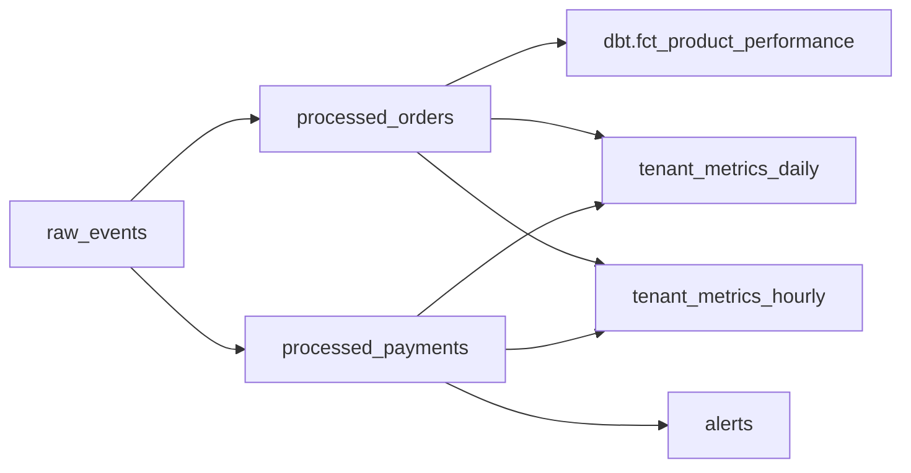
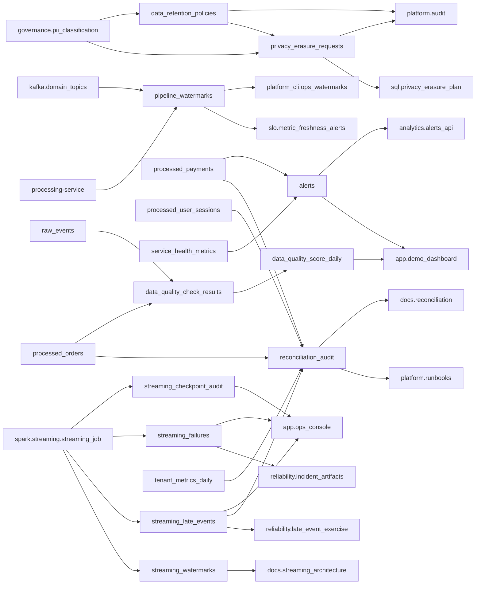
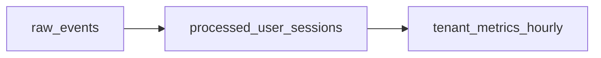

# Data Lineage Graph

Generated from `catalog/data_catalog.json`. Do not hand-edit —
regenerate with `python scripts/generate_lineage_report.py` or
`make lineage-graph`.

Every edge below either connects two cataloged tables, or connects
a table to an external node (`analytics.*`, `app.*`, `spark.*`,
`dbt.*`, `reliability.*`, `platform_cli.*`) whose claim is
cross-referenced against real code by `lineage/graph.py` — see
"Graph Validation" below and `docs/lineage.md` "What this
framework itself caught" for the mismatches this check has found.

## Graph Validation

- Cycles detected: **0**
- Orphan tables (no upstream or downstream): **0**
- Unverified edges (claimed but not found in code): **0**
- Unrecognized external nodes: **0**

## Lineage by Domain

### Finance

### Operations

### Platform

```mermaid
flowchart LR
    dbt_jobs["dbt.jobs"] --> lineage_events["lineage_events"]
    event_inbox["event_inbox"] --> ops_pipeline_run_log["ops.pipeline_run_log"]
    event_inbox["event_inbox"] --> raw_events["raw_events"]
    event_outbox["event_outbox"] --> kafka_domain_topics["kafka.domain_topics"]
    event_outbox["event_outbox"] --> lineage_events["lineage_events"]
    kafka_domain_topics["kafka.domain_topics"] --> event_inbox["event_inbox"]
    kafka_domain_topics["kafka.domain_topics"] --> raw_events["raw_events"]
    kafka_domain_topics["kafka.domain_topics"] --> stream_window_metrics["stream_window_metrics"]
    lineage_events["lineage_events"] --> app_ops_console["app.ops_console"]
    lineage_events["lineage_events"] --> docs_openlineage_tracking["docs.openlineage_tracking"]
    lineage_events["lineage_events"] --> platform_runbooks["platform.runbooks"]
    pipeline_run_log["pipeline_run_log"] --> analytics_metrics_api["analytics.metrics_api"]
    pipeline_run_log["pipeline_run_log"] --> app_demo_dashboard["app.demo_dashboard"]
    pipeline_run_log["pipeline_run_log"] --> app_ops_console["app.ops_console"]
    pipeline_run_log["pipeline_run_log"] --> lineage_events["lineage_events"]
    processed_orders["processed_orders"] --> tenant_metrics_hourly["tenant_metrics_hourly"]
    processed_payments["processed_payments"] --> tenant_metrics_hourly["tenant_metrics_hourly"]
    processed_user_sessions["processed_user_sessions"] --> tenant_metrics_hourly["tenant_metrics_hourly"]
    processing_service["processing-service"] --> pipeline_run_log["pipeline_run_log"]
    raw_events["raw_events"] --> processed_orders["processed_orders"]
    raw_events["raw_events"] --> processed_payments["processed_payments"]
    raw_events["raw_events"] --> processed_user_sessions["processed_user_sessions"]
    raw_events["raw_events"] --> spark_tenant_user_session_summary_stage["spark.tenant_user_session_summary_stage"]
    raw_events["raw_events"] --> tenant_metrics_hourly["tenant_metrics_hourly"]
    reliability_runner["reliability.runner"] --> pipeline_run_log["pipeline_run_log"]
    scripts_backfill_metrics["scripts.backfill_metrics"] --> pipeline_run_log["pipeline_run_log"]
    service_health_metrics["service_health_metrics"] --> alerts["alerts"]
    service_health_metrics["service_health_metrics"] --> analytics_tenant_health_score_api["analytics.tenant_health_score_api"]
    service_health_metrics["service_health_metrics"] --> app_ops_console["app.ops_console"]
    services_schema_registry_service["services.schema_registry_service"] --> schema_registry_compatibility_checks["schema_registry_compatibility_checks"]
    services_schema_registry_service["services.schema_registry_service"] --> schema_registry_subjects["schema_registry_subjects"]
    services_schema_registry_service["services.schema_registry_service"] --> schema_registry_versions["schema_registry_versions"]
    source_transactional_systems["source.transactional_systems"] --> event_outbox["event_outbox"]
    spark_batch_revenue_aggregates["spark.batch_revenue_aggregates"] --> tenant_metrics_daily["tenant_metrics_daily"]
    spark_jobs["spark.jobs"] --> lineage_events["lineage_events"]
    spark_streaming_streaming_job["spark.streaming.streaming_job"] --> stream_processing_runs["stream_processing_runs"]
    spark_streaming_streaming_job["spark.streaming.streaming_job"] --> stream_window_metrics["stream_window_metrics"]
    stream_processing_runs["stream_processing_runs"] --> app_ops_console["app.ops_console"]
    stream_processing_runs["stream_processing_runs"] --> streaming_checkpoint_audit["streaming_checkpoint_audit"]
    stream_processing_runs["stream_processing_runs"] --> streaming_failures["streaming_failures"]
    stream_processing_runs["stream_processing_runs"] --> streaming_watermarks["streaming_watermarks"]
    stream_window_metrics["stream_window_metrics"] --> app_ops_console["app.ops_console"]
    system_health["system.health"] --> service_health_metrics["service_health_metrics"]
    tenant_metrics_daily["tenant_metrics_daily"] --> analytics_metrics_api["analytics.metrics_api"]
    tenant_metrics_daily["tenant_metrics_daily"] --> app_demo_dashboard["app.demo_dashboard"]
    tenant_metrics_daily["tenant_metrics_daily"] --> dbt_fct_tenant_daily_metrics["dbt.fct_tenant_daily_metrics"]
    tenant_metrics_daily["tenant_metrics_daily"] --> reconciliation_audit["reconciliation_audit"]
    tenant_metrics_hourly["tenant_metrics_hourly"] --> tenant_metrics_daily["tenant_metrics_daily"]
```

### Product

## Table Reference

| Table | Domain | Layer | Owner | Upstream | Downstream |
| --- | --- | --- | --- | --- | --- |
| `alerts` | operations | serving | data-platform | processed_payments, service_health_metrics | analytics.alerts_api, app.demo_dashboard |
| `data_quality_check_results` | operations | observability | data-platform | raw_events, processed_orders | data_quality_score_daily |
| `data_quality_score_daily` | operations | serving | data-platform | data_quality_check_results | app.demo_dashboard |
| `data_retention_policies` | operations | governance | data-platform-governance | governance.pii_classification | privacy_erasure_requests, platform.audit |
| `event_inbox` | platform | operational | data-platform | kafka.domain_topics | raw_events, ops.pipeline_run_log |
| `event_outbox` | platform | operational | data-platform | source.transactional_systems | kafka.domain_topics, lineage_events |
| `lineage_events` | platform | observability | data-platform | pipeline_run_log, spark.jobs, dbt.jobs | docs.openlineage_tracking, platform.runbooks, app.ops_console |
| `pipeline_run_log` | platform | observability | data-platform | scripts.backfill_metrics, reliability.runner, processing-service | app.ops_console, app.demo_dashboard, lineage_events, analytics.metrics_api |
| `pipeline_watermarks` | operations | observability | data-platform | kafka.domain_topics, processing-service | platform_cli.ops_watermarks, slo.metric_freshness_alerts |
| `privacy_erasure_requests` | operations | governance | data-platform-governance | governance.pii_classification | sql.privacy_erasure_plan, platform.audit |
| `processed_orders` | finance | silver | finance-analytics | raw_events | tenant_metrics_hourly, tenant_metrics_daily, dbt.fct_product_performance |
| `processed_payments` | finance | silver | finance-analytics | raw_events | tenant_metrics_hourly, tenant_metrics_daily, alerts |
| `processed_user_sessions` | product | silver | product-analytics | raw_events | tenant_metrics_hourly |
| `raw_events` | platform | bronze | data-platform | kafka.domain_topics | processed_orders, processed_payments, processed_user_sessions, tenant_metrics_hourly, spark.tenant_user_session_summary_stage |
| `reconciliation_audit` | operations | observability | data-platform | tenant_metrics_daily, processed_orders, processed_payments, processed_user_sessions | docs.reconciliation, platform.runbooks |
| `schema_registry_compatibility_checks` | platform | observability | data-platform | services.schema_registry_service | — |
| `schema_registry_subjects` | platform | governance | data-platform | services.schema_registry_service | — |
| `schema_registry_versions` | platform | governance | data-platform | services.schema_registry_service | — |
| `service_health_metrics` | platform | serving | data-platform | system.health | alerts, analytics.tenant_health_score_api, app.ops_console |
| `stream_processing_runs` | platform | operational | data-platform | spark.streaming.streaming_job | streaming_checkpoint_audit, streaming_failures, streaming_watermarks, app.ops_console |
| `stream_window_metrics` | platform | gold | data-platform | kafka.domain_topics, spark.streaming.streaming_job | app.ops_console |
| `streaming_checkpoint_audit` | operations | observability | data-platform | spark.streaming.streaming_job | app.ops_console |
| `streaming_failures` | operations | observability | data-platform | spark.streaming.streaming_job | app.ops_console, reliability.incident_artifacts |
| `streaming_late_events` | operations | observability | data-platform | spark.streaming.streaming_job | reconciliation_audit, app.ops_console, reliability.late_event_exercise |
| `streaming_watermarks` | operations | observability | data-platform | spark.streaming.streaming_job | docs.streaming_architecture |
| `tenant_metrics_daily` | platform | gold | data-platform | tenant_metrics_hourly, spark.batch_revenue_aggregates | analytics.metrics_api, dbt.fct_tenant_daily_metrics, app.demo_dashboard, reconciliation_audit |
| `tenant_metrics_hourly` | platform | gold | data-platform | processed_orders, processed_payments, processed_user_sessions | tenant_metrics_daily |
